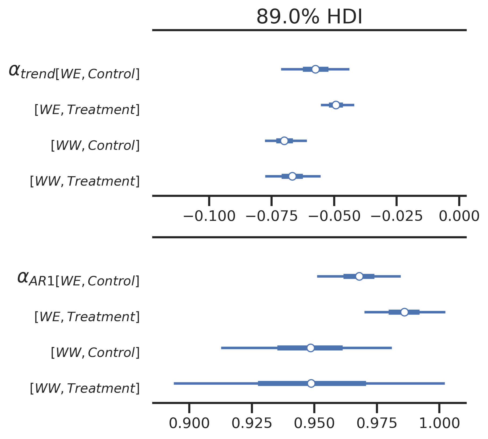

<!-- See: https://github.com/dare-centre/dare-marp-poster-template -->
<!-- Start header -->

<!-- Image in the upper left -->

<!-- Title and author information -->

# Framework for interpretable Bayesian soil moisture modelling

## Joshua A. Simmons1*, Amanda Graaf2, Vanessa Pino2, <u>R. Willem Vervoort</u>1,2

##### 1 - Data Analytics for Resources and Environment (DARE), ARC Industrial Transformation Training Centre, University of Sydney   [_joshua.simmons@sydney.edu.au_](mailto:joshua.simmons@sydney.edu.au)  [_@dare-centre_](https://github.com/dare-centre)
##### 2 - School of Life and Environmental Sciences, The University of Sydney, New South Wales, Australia

<!-- Image on the upper right -->

<!-- End header -->

  

<!-- Start main 3 column split for poster -->

<!-- Start main column 1 -->

### Introduction

 Soil moisture is a key driver of hydrological processes such as flooding during wet periods, and vegetation growth in dry periods, but is highly variable in time and space

Soil moisture can vary due to:

- landcover
- soil type

- landscape position
- rainfall input

- evaporation

Disentangling the different drivers and spatial relationships in soil moisture is important to delivering forecasts of water availability. There is a need for data science approaches which allow computationally efficient modelling (as opposed to numerical models) while remaining interpretable with quantified uncertainty (as opposed to, for example, neural networks).

<b>Figure 1:</b> <i>Model predictions of soil moisture at probe WE-12-01.</i>

### Methodology

  Objective: Demonstrate a Bayesian model for one-day ahead forecast framework that quantifies uncertainties and disentangles the relative importance of different drivers across treatment/control groups

The **data are from a dense observation network at Llara farm in Narrabri (NSW)**, part of a landscape rehydration project. Soil moisture probes are located across two 40ha sites with some control and treatment areas in each. The treatment aims to reduce overland flow velocities and increase infiltration. The study uses 16 months of 10-min data aggregated to **daily across 32 gauges** at a common depth below the surface (200 mm).

A **Hierarchical Linear Model (HLM)** is fit using a Bayesian approach (built using the NumPyro PPL). Partial pooling provides a description of gauge ($g$) level parameters, grouped by site ($s$) and treatment ($tr$). Soil moisture at time $t$ ($SM_t$) is modelled as a linear regression of:

- $R$: daily rainfall from a nearby SILO gauge (parameter $\beta_R$) with a power transformation ($\xi$) for a non-linear effect
- an trend term which accounts for drying (parameter $\beta_{trend}$)

- an autoregressive term using the soil moisture from the previous timestep ($SM_{t-1}$ with parameter $\beta_{AR1}$)

$$
\begin{aligned}
SM_t &= f(R,SM_{t-1}) + \epsilon \qquad \epsilon \sim \mathcal{N}(0,\sigma)\\[1em]
SM_{t[g]} &=\beta_{R[g]} \cdot R ^ \xi + \beta_{trend[g]} + \beta_{AR1[g]} \cdot SM_{t-1[g]}
\end{aligned}
$$

then for the base model with no interaction on the rainfall effect

$$
\begin{aligned}
\beta_{[g]} = \mathcal{N}(\alpha_{[s,tr]}, \tau_{[s,tr]}) \quad \text{for } R,\space trend,\space AR1\\[1em]
\alpha_{[s,tr]} \sim N(0,2) \quad \text{for } R,\space trend,\space AR1
\end{aligned}
$$

or in a model with an interaction of rainfall and the antecedent soil moisture conditions (with matching specification of group level priors to above)

$$
\begin{aligned}
\beta_{R} = \beta_{r0} + \beta_{r1} SM_{t-1}
\end{aligned}
$$

### Results

<b>Table 1:</b> <i>Model performance across the 32 gauges. Performance is measured using the Brier Skill Score (BSS) with a baseline of persistence from the previous day's observation (closer to 1 is better).</i>

| Rainfall effect | BSS (mean)               | BSS > 0.2 | BSS > 0.5 | BSS > 0.7 |
| :----------: | :----------------------: | :-------: | :-------: | :-------: |
| $\beta_{R}$  | $0.31 \space (\pm 0.31)$ | 24        | 10        | 0         |
| $\beta_{r0} + SM_{t-1} \beta_{r1}$ | $0.58 \space (\pm 0.11)$ | 32 | 25 | 4 |

The model adequately reproduces the observations with a mean Brier Skill Score (against a baseline of persistence) of 0.58 across the gauges (Table 1). The inclusion improvement of the model when including an interaction of $SM_{t-1}$ in the rainfall effect ($\beta_R$) shows the importance of antecendent soil moisture conditions in modelling change.

<!-- End main column 1 -->

<!-- Start main column 2 -->

<b>Figure 2a:</b> <i>Group level parameter means for combinations of site and control/treatment. Top: the rainfall effect intercept ($\alpha_{r0}$). Bottom: the interaction of antecedent soil moisture with rainfall ($\alpha_{r1}$).</i>

<b>Figure 2b:</b> <i>Group level parameter means for combinations of site and control/treatment. Top: the overall trend parameter or intercept term ($\alpha_{trend}$). Bottom: the autoregressive term applied to $SM_{t-1}$ ($\alpha_{AR1}$).</i>

 

The treatment sites show slightly reduced responsiveness to rainfall (more apparent at WE), though there is much greater variation in the rainfall effect between site WE and WW (Figure 2a). Treatment sites tend to show slower drying rates (again more apparent at WE), but the variability between sites is still much greater between sites than treatments (Figure 2b).

Furthermore, the interaction between rainfall and past soil moisture is mostly small or negative suggesting that higher previous soil moisture leads to less change in soil moisture with rainfall. In other words drier soils infiltrate more water. The lack of difference observed between the treatments could simply be related to the fact that the treatments were only established 16 months before. 

 
 

<b>Figure 3:</b> <i>Top: Spatial variability in the strength of the parameter representing rainfall effect across the two sites (WE and WW). Bottom: Spatial variability in the variance of the residuals across the two sites (WE and WW).</i>

### Discussion

Figure 3 shows the spatial variability in the rainfall effect intercepts and the variance of the residuals. These broadly pick up the variation in soil, with coarser sandier soils on the northern side (and in WW) and deeper clay soils on the southern side in WE.  Further work must be done to fully account for the spatial variability in the model, including for the residuals which were also found to be heavy-tailed. 

The relevance of the framework is that it is interpretable, quantifies modelling uncertainty, can be easily extended to include more variables, and serves as a model for other environmental monitoring networks. Future work will include quantifying comparing with generalised additive models to capture non-linear effects and incorporating more spatial information (potentially using Gaussian Processes).

<!-- Code/Refs/Thanks/Funding - small section -->
###

#### Code 

[github.com/dare-centre/llara-soil-moisture](https://github.com/dare-centre/llara-soil-moisture)

#### Funding

Funding for the Landscape rehydration project is through a generous donation. 

 

We thank the Australian Government for supporting this research through the Australian Research Council’s Industrial Transformation Training Centre in Data Analytics for Resources and Environments (DARE) (project IC190100031).

<!-- End main column 2 -->

<!-- End main columns -->

